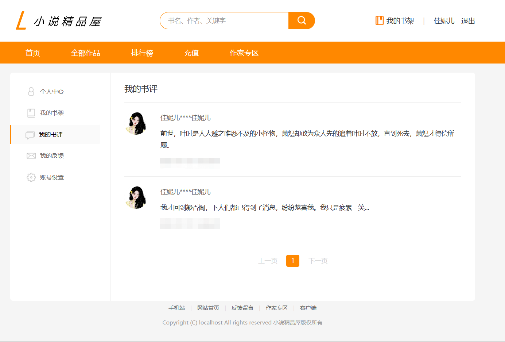
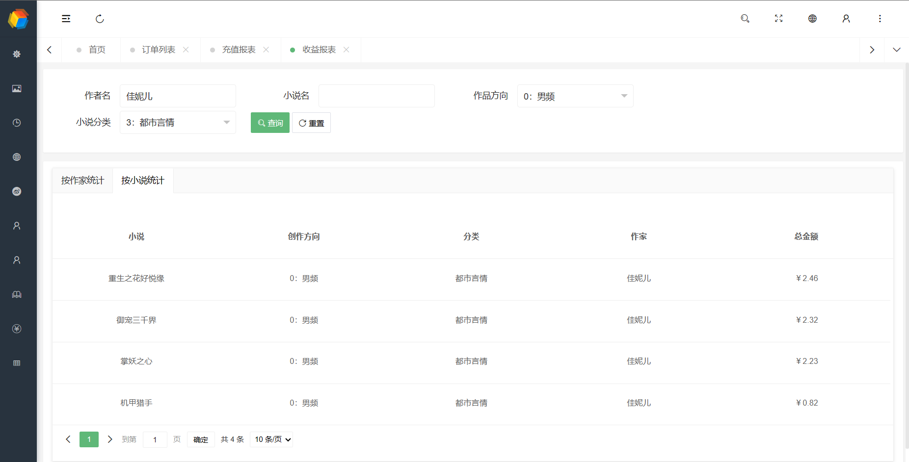

<h1>本项目仅用于学习和交流</h1>

<h1>基于/使用/参考的项目</h1>
<h5> <a href="https://layui.org.cn/">Layui / layui</a></h5>
<h5> <a href="https://gitee.com/pear-admin/pear-admin-flask">Pear Admin / Pear Admin Flask</a></h5>
<h5> <a href="https://gitee.com/novel_dev_team/novel-plus">小说精品屋 / novel-plus</a></h5>
<h5> <a href="https://gitee.com/maplemei/xm-select">maplemei / xm-select</a></h5>
<h5> <a href="https://gitee.com/lolicode/layui_component_tableselect">sakuya / LayUi组件：TableSelect</a></h5>

## 项目介绍

novel-flask，是一个使用Pear Admin Flask作为管理后台，使用Flask仿照/基于优秀项目“小说精品屋”开发的项目

## 截图







## 项目结构

```
novel-flask
├── apps -- 所有应用目录，包括前台front应用和后台admin应用
├── docs -- 存放了一些文档/笔记/sql脚本
├── plugins -- 项目用到的插件
├── pub -- 项目公共模块，主要提供一些常量、工具脚本，以及各个app公用的配置、扩展（数据库、邮件、文件上传工具等的初始化/配置）、模型类等
└── manage_admin.py -- 后台app启动脚本
└── manage_front.py -- 前台app启动脚本
```

## app结构（以前台front app为例）

```
front
├── dto -- 数据传输对象包装类，主要用于api的输入输出约束
├── exts -- 初始化项目用到的扩展，例如jwt等
├── logic -- 功能模块的具体业务逻辑，当业务逻辑代码较多的时候，则将业务逻辑写在该层下
├── service -- 由于views层各个模块（蓝图）之间、本模块之内，存在大量可复用代码/逻辑，和logic层的不同，主要在于本层提供的是公用的业务逻辑，多个功能模块都有可能调用
├── static -- 存放css、js等静态资源的地方
├── templates -- 存放html页面的地方
└── views -- 视图函数
├── __init__.py -- app初始化脚本，所有扩展均在此初始化、引入
└── config.py -- app配置脚本
```

## 技术选型

| 技术                 | 说明                                                                                      |
|--------------------|-----------------------------------------------------------------------------------------|
| Flask              | 小而美的python web框架                                                                        |
| MySQL              | 数据库服务                                                                                   |
| pymysql            | 数据库连接                                                                                   |
| Flask SQLAlchemy   | ORM框架，可提供多数据源支持                                                                         |
| Redis              | 缓存中间件                                                                                   |
| flask-siwadoc      | swagger api文档                                                                           |
| Flask-JWT-Extended | 提供前台登录支持                                                                                |
| Flask-Login        | 提供后台登录支持                                                                                |
| Flask-Upload       | 文件上传                                                                                    |
| Jinja2             | 模板引擎                                                                                    |
| marshmallow        | 序列化工具（用于模型类的序列化、反序列化，便于Redis存取、与前端交互）                                                   |
| jsonpickle         | 序列化工具（本项目主要用于进程间、网络传输时的序列化、反序列化）                                                        |
| nltk               | 字符处理统计                                                                                  |
| alipay             | 阿里支付SDK                                                                                 |
| Layui              | 前端 UI 框架                                                                                |
| Flask sqlacodegen  | 数据库逆向工程，用于根据已有数据库表反向生成模型类（项目中已剔除，由于其使用sqlacodegen，而sqlacodegen使用的SQLAlchemy远低于本项目使用的版本） |

## 运行方法
<h5>1.安装好MySQL（8.x）、Redis（windows平台 5.0.14.1）、python 3.11</h5>
<h5>
2.（1）将docs/sqls下的2个数据库建好，然后执行脚本创建表和添加数据<br>
（2）全量数据到仓库<a href="https://gitee.com/dhqcxf/novel-flask-data">novel-flask-data</a>获取<br>
注意：全量仓库里的数据库表结构不一定是最新的，因此项目docs/sqls下的增量脚本需要手动执行<br>
（3）通过命令或通过pycharm图形界面建立虚拟环境<br>
（4）如需全局配置镜像源为清华镜像源，则执行：pip config set global.index-url https://pypi.tuna.tsinghua.edu.cn/simple <br>
（5）执行 pip install -r requirements.txt<br>
</h5>
<h5>
3.修改配置：pub/config.py，需修改以下项：<br>
BaseConfig：<br>
    （1）UPLOADED_PHOTOS_DEST<br>
    （2）REDIS相关配置<br>
    （3）MYSQL相关配置<br>
    （4）SQLALCHEMY_BINDS（把两个数据库的数据源写进去，也可以只写一个，因为另一个作为默认的数据库连接，已经在SQLALCHEMY_DATABASE_URI配好）
</h5>
<h5>
4.修改配置：apps/front/config.py，按需修改，可以不修改
</h5>
<h5>
5.修改配置：apps/admin/config.py，按需修改，可以不修改
</h5>
<h5>
6.运行：<br>
（1）启动后台：运行manage_admin.py
<br>
测试账号：admin/111111
<br>
（2）启动前台：运行manage_front.py
<br>
测试账号：
<br>
17816600001/111111
<br>
17816600002/111111
<br>
17816610001/111111
<br>
17816610002/111111
<br>
</h5>

<h5>
<br>7.接口文档：<br>
前台：127.0.0.1:8080/docs
<br>
后台：127.0.0.1:5000/docs
<br>
账号：111111
<br>
密码：111111
<br>
</h5>

<h5>
<br>8.支付配置：<br>
在支付宝平台申请应用id（APP_ID）、应用私钥（APP_PRIVATE_KEY）、支付宝公钥（ALIPAY_PUBLIC_KEY）
<br>
将APP_ID、APP_PRIVATE_KEY、ALIPAY_PUBLIC_KEY配置到系统环境变量中，以供程序调取
<br>
</h5>